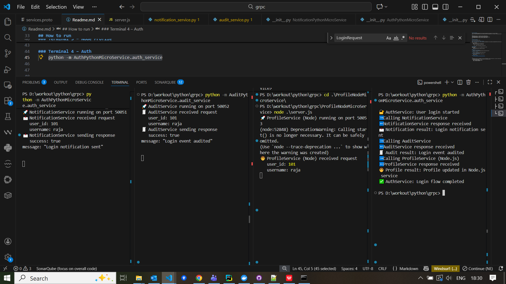
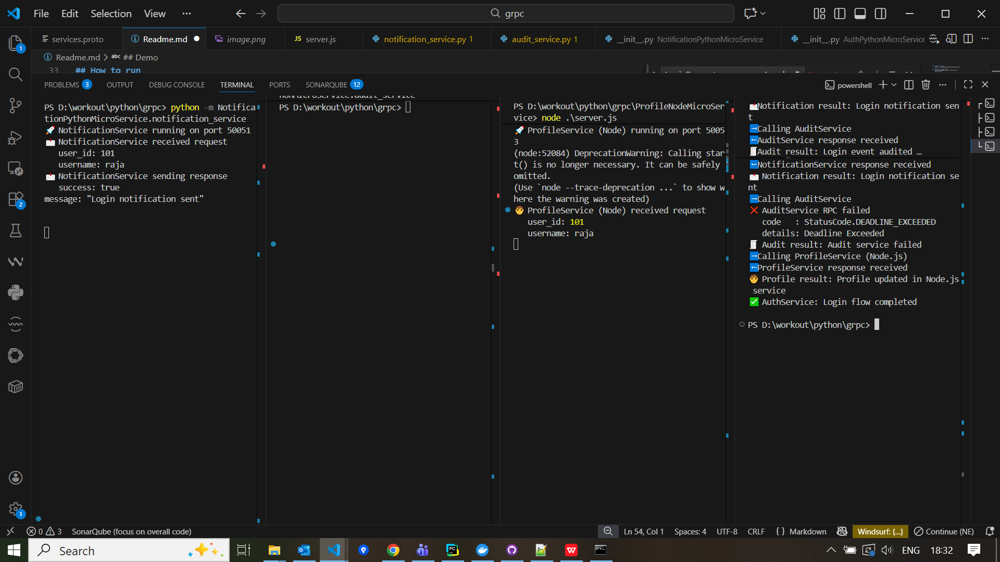

## Project Overview
This project demonstrates how microservices communicate with each other using gRPC.
When a user logs in:
### 1. AuthPythonMicroService is triggered
### 2. From the Auth service, gRPC calls are made to:
    - Audit microservice
    - Notification microservice
    - Profile microservice

### 3. Each service processes the request and returns a response back to the Auth service

## This project also shows:
    - Request/response communication (not just triggering)
    - Timeout handling
    - Behavior when a service is down
    - Cross-language gRPC communication (Python ↔ Node.js)

### Microservices in This Project
    - AuthPythonMicroService - Python Micro Service (gRPC Client)
    - AuditPythonMicroService - Python Micro Service (gRPC Server1)
    - NotificationPythonMicroService - Python Micro Service (gRPC Server2)
    - ProfileNodeMicroService - Node Micro Service (gRPC Server3)

### gRPC Contract
All services use a common gRPC contract defined in:
    proto/services.proto
    
### Generate the Python gRPC files using:
python -m grpc_tools.protoc -I proto --python_out=autogenerated --grpc_python_out=autogenerated proto/services.proto

### Required packages:
pip install grpcio grpcio-tools

### Important Note (Python Import Fix)
After generating the files, update the following file:
    update autogenerated/services_pb2_grpc.py 
    from
        import services_pb2 as services__pb2
    to
        from . import services_pb2 as services__pb2
    
    This fix is required because the Python gRPC generator uses absolute imports by default and does not automatically handle package-based imports.

## Node.js Setup (Profile Service)
Open a terminal and navigate to the ProfileNodeMicroService folder:
Then install
    npm init -y
    npm install @grpc/grpc-js @grpc/proto-loader

--- 

## How to Run the Services
Open four terminals and start the services as shown below.
### Terminal 1 – Notification
    python -m NotificationPythonMicroService.notification_service 

### Terminal 2 – Audit
    python -m AuditPythonMicroService.audit_service

### Terminal 3 – Node Profile
    cd ProfileNodeMicroService
    node server.js

### Terminal 4 – Auth
    python -m AuthPythonMicroService.auth_service

---

## Demo
### When all services are up and running, the Auth service successfully calls:
    - Notification service
    - Audit service
    - Profile service

### Audit Service Down

--- 

### Timeout / Server Not Reachable Scenario
To simulate a slow or unreachable service:

    - Open audit_service.py
    - Uncomment the time.sleep(5) line (line number 11)
    - Restart the Audit service

Since the client timeout is set to 2 seconds, the call fails with:
    AuditService RPC failed 
    code : StatusCode.DEADLINE_EXCEEDED 
    details: Deadline Exceeded

